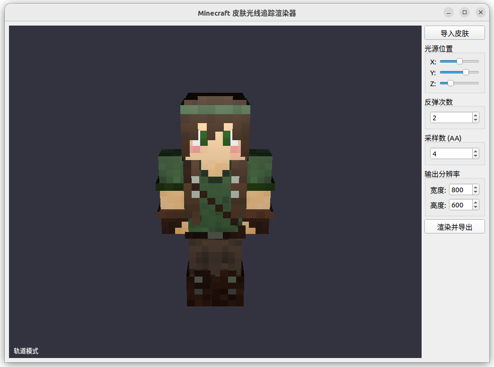

# MCSkin RaytraceRenderer

Minecraft 皮肤光线追踪渲染器 — 基于纯 CPU 软件光线追踪的桌面应用，将 Minecraft 皮肤文件渲染为高质量图像。




## 功能

- 支持 64×64（新版）和 64×32（旧版）Minecraft 皮肤 PNG，自动识别格式
- 输入正版用户名自动从 Mojang API 获取并下载皮肤
- 自动将皮肤纹理映射到标准角色盒体模型（头部、躯干、四肢），含内层和外层
- Blinn-Phong 光照 + 漫反射 + 镜面高光 + 阴影 + 多次反射
- 基于图块的多线程并行渲染，自动利用所有 CPU 核心
- OpenGL 实时预览，支持轨道模式（鼠标拖拽/滚轮）和自由漫游模式（WASD）
- 光源位置、反弹次数、采样数、输出分辨率均可调节
- 渲染结果导出为 PNG，带进度条

## 快速开始

### Linux

```bash
# 一键安装依赖并构建
./scripts/setup.sh
```

或手动操作：

```bash
# Ubuntu/Debian
sudo apt install -y build-essential cmake git \
    qt6-base-dev libqt6opengl6-dev libqt6network6-dev qt6-base-dev-tools libgl-dev

# 构建
mkdir -p build && cd build
cmake .. && make -j$(nproc)
```

### Windows

```powershell
# PowerShell 一键构建
.\scripts\setup.ps1
```

或手动操作：

```powershell
# 需要: Visual Studio 2022 (或 MSVC Build Tools), CMake, Git, Qt6 (msvc2022_64)
mkdir build; cd build
cmake .. -DCMAKE_PREFIX_PATH="C:\Qt\6.x.x\msvc2022_64"
cmake --build . --config Release -j $env:NUMBER_OF_PROCESSORS

# 部署 Qt DLL
cmake --install . --config Release
```

> GLM、Google Test、RapidCheck 均通过 CMake FetchContent 自动下载，无需手动安装。

## 运行

```bash
# Linux
./build/src/mcskin_raytracer

# Windows (构建后需先 cmake --install 部署 Qt DLL)
.\build\src\Release\mcskin_raytracer.exe
```

1. 点击「导入皮肤」选择本地 Minecraft 皮肤 PNG，或在用户名框输入正版用户名点击「获取」自动下载
2. 预览窗口显示 3D 模型，鼠标拖拽旋转、滚轮缩放，右键切换自由漫游
3. 调整右侧面板参数（光源位置 / 反弹次数 / 采样数 / 分辨率）
4. 点击「渲染并导出」保存 PNG

## 测试

```bash
# Linux
./build/tests/mcskin_tests

# Windows
.\build\tests\Release\mcskin_tests.exe

# 按模块筛选
./build/tests/mcskin_tests --gtest_filter="SkinParser*"
./build/tests/mcskin_tests --gtest_filter="TileRenderer*"
```

## 项目结构

```
├── CMakeLists.txt                  # 根构建配置
├── scripts/
│   ├── setup.sh                    # Linux 一键构建脚本
│   └── setup.ps1                   # Windows PowerShell 一键构建脚本
├── src/
│   ├── CMakeLists.txt              # 构建配置（core 静态库 + GUI 可执行文件）
│   ├── main.cpp                    # 程序入口
│   ├── math/                       # 基础数学类型
│   │   ├── vec3.h                  #   三维向量
│   │   ├── color.h                 #   RGBA 颜色
│   │   └── ray.h                   #   光线
│   ├── skin/                       # 皮肤解析
│   │   ├── skin_parser.{h,cpp}     #   PNG → SkinData（自动识别格式）
│   │   ├── image.{h,cpp}           #   图像加载/保存
│   │   ├── texture_region.h        #   纹理区域 + UV 采样
│   │   └── stb_impl.cpp           #   stb 库实现
│   ├── scene/                      # 场景数据
│   │   ├── scene.h                 #   场景（网格 + 光源 + 相机）
│   │   ├── mesh.h                  #   网格（三角形集合）
│   │   ├── triangle.h              #   三角形 + 求交结果
│   │   ├── mesh_builder.{h,cpp}    #   SkinData → Scene 构建器
│   │   └── camera.cpp              #   相机光线生成
│   ├── raytracer/                  # 光线追踪核心
│   │   ├── intersection.{h,cpp}    #   光线-AABB 求交（slab method）
│   │   ├── shading.{h,cpp}         #   Blinn-Phong 着色 + 阴影
│   │   ├── raytracer.{h,cpp}       #   递归光线追踪
│   │   └── tile_renderer.{h,cpp}   #   多线程图块渲染
│   ├── output/                     # 图像输出
│   │   └── image_writer.{h,cpp}    #   PNG 导出
│   └── gui/                        # Qt GUI
│       ├── main_window.{h,cpp}     #   主窗口 + 控制面板
│       ├── raster_preview.{h,cpp}  #   OpenGL 3.3 实时预览
│       └── camera_controller.{h,cpp} # 自由漫游相机控制器
├── tests/                          # 单元测试 + 属性测试（138 个用例）
└── third_party/stb/                # stb_image / stb_image_write（已内置）
```

## 依赖

| 依赖 | 版本 | 说明 |
|------|------|------|
| CMake | ≥ 3.22 | 构建系统 |
| C++17 | GCC 9+ / Clang 10+ / MSVC 2019+ | 编译器 |
| Qt 6 | ≥ 6.2 | GUI（Widgets, OpenGL, OpenGLWidgets, Network） |
| GLM | 1.0.1 | 数学库（FetchContent 自动下载） |
| Google Test | 1.15.2 | 单元测试（FetchContent 自动下载） |
| RapidCheck | latest | 属性测试（FetchContent 自动下载） |
| stb | 已内置 | PNG 读写 |
| OpenGL | ≥ 3.3 | 实时预览 |

### Linux 各发行版安装命令

<details>
<summary>Ubuntu / Debian</summary>

```bash
sudo apt update
sudo apt install -y build-essential cmake git \
    qt6-base-dev libqt6opengl6-dev libqt6network6-dev qt6-base-dev-tools libgl-dev
```
</details>

<details>
<summary>Arch Linux</summary>

```bash
sudo pacman -S base-devel cmake git qt6-base
```
</details>

<details>
<summary>Fedora</summary>

```bash
sudo dnf install gcc-c++ cmake git qt6-qtbase-devel mesa-libGL-devel
```
</details>

<details>
<summary>Windows</summary>

1. 安装 [Visual Studio 2022](https://visualstudio.microsoft.com/downloads/) 或 MSVC Build Tools（勾选 C++ 桌面开发）
2. 安装 [CMake](https://cmake.org/download/)
3. 安装 [Git](https://git-scm.com/download/win)
4. 安装 [Qt 6](https://www.qt.io/download-qt-installer)（选择 msvc2022_64 组件）

```powershell
cmake -B build -DCMAKE_PREFIX_PATH="C:\Qt\6.x.x\msvc2022_64"
cmake --build build --config Release
cmake --install build --config Release   # 部署 Qt DLL
```
</details>

## 架构

```
皮肤 PNG ──→ SkinParser ──→ SkinData ──→ MeshBuilder ──→ Scene
                                                          │
                                          ┌───────────────┼───────────────┐
                                          ▼               ▼               ▼
                                    RasterPreview    TileRenderer    GUI 控制面板
                                    (OpenGL 预览)   (多线程光追)    (参数调节)
                                                          │
                                                          ▼
                                                    ImageWriter ──→ PNG 文件
```

渲染核心：纯 CPU 光线追踪，slab method 光线-AABB 求交，Blinn-Phong 着色。图像划分为 32×32 图块，工作线程通过原子计数器抢占式分配任务。预览使用 OpenGL 3.3 Core Profile。渲染在后台 `std::thread` 执行，通过 `Qt::QueuedConnection` 更新 UI。

## License

MIT
